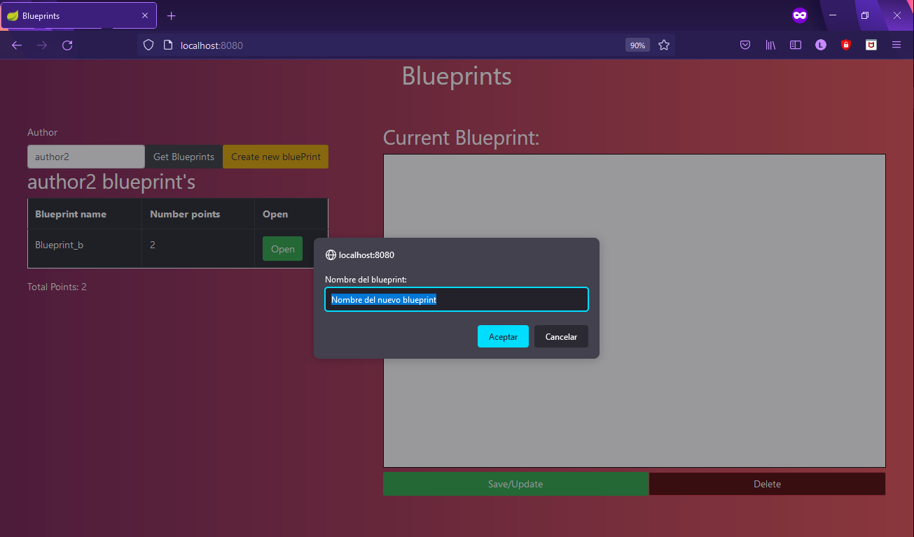
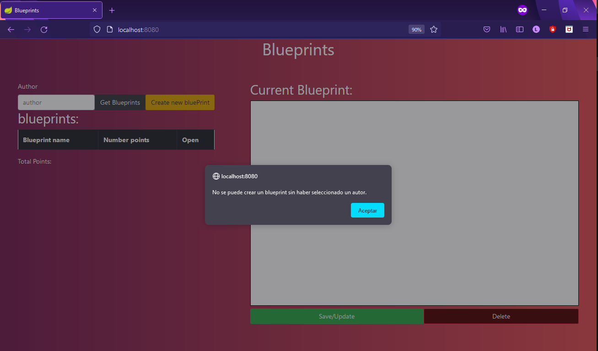
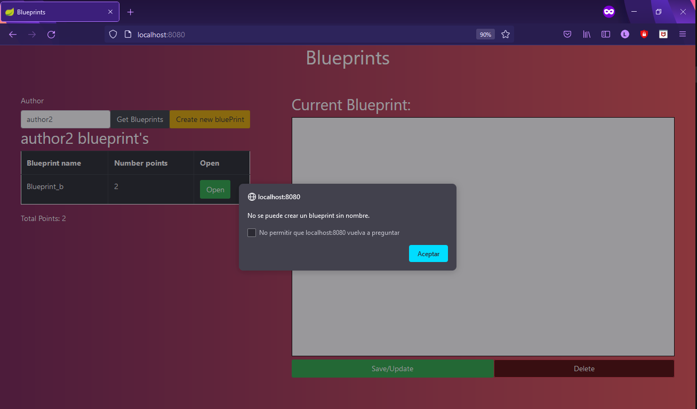
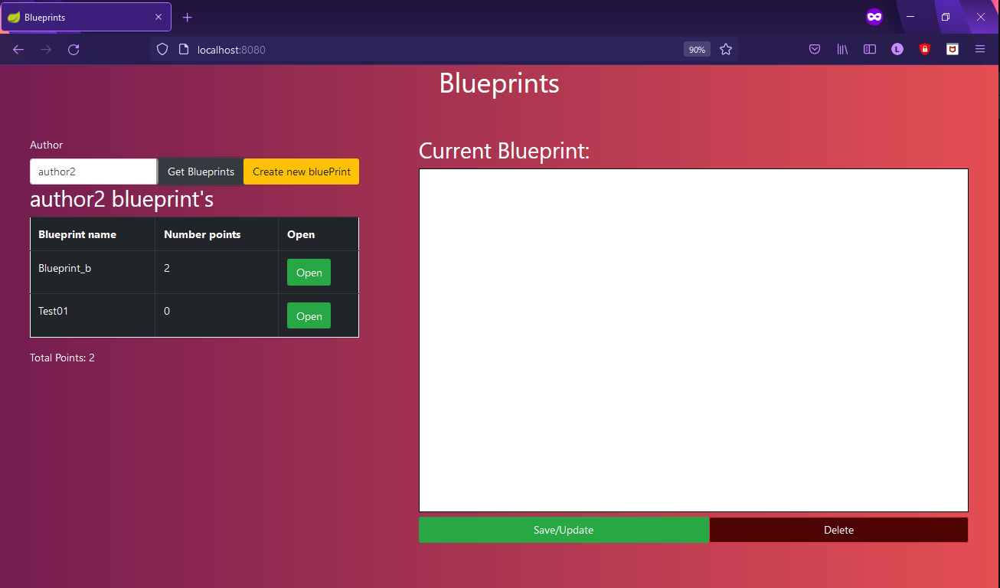
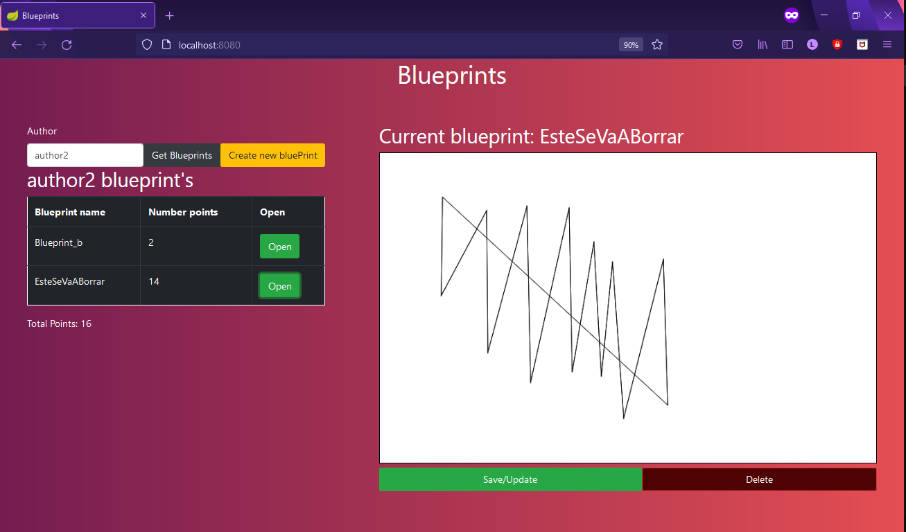
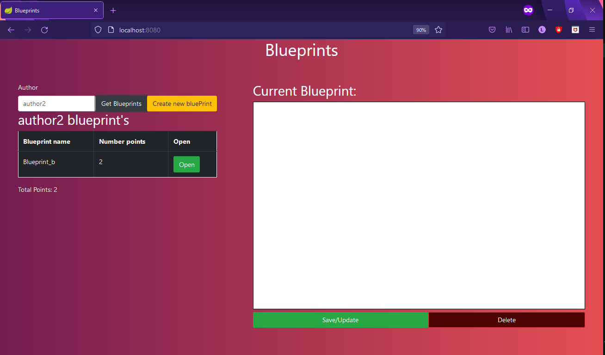

### Escuela Colombiana de Ingeniería
### Arquitecturas de Software - ARSW
## Laboratorio Construción de un cliente 'grueso' con un API REST, HTML5, Javascript y CSS3. Parte II.

### Dependencias:
* [Laboratorio API REST para la gestión de planos.](https://github.com/ARSW-ECI-beta/REST_API-JAVA-BLUEPRINTS_PART2)
* [Laboratorio construción de un cliente ‘grueso’ con un API REST, HTML5, Javascript y CSS3. Parte I](https://github.com/ARSW-ECI-beta/REST_CLIENT-HTML5_JAVASCRIPT_CSS3_GRADLE-BLUEPRINTS_PART1)

### Descripción 
Este laboratorio tiene como fin, actualizar en Front para que se pueda comunicar con los servicios del REST API desarrollado anteriormente
### Parte I


1. Agregue al canvas de la página un manejador de eventos que permita capturar los 'clicks' realizados, bien sea a través del mouse, o a través de una pantalla táctil. Para esto, tenga en cuenta [este ejemplo de uso de los eventos de tipo 'PointerEvent'](https://mobiforge.com/design-development/html5-pointer-events-api-combining-touch-mouse-and-pen) (aún no soportado por todos los navegadores) para este fin. Recuerde que a diferencia del ejemplo anterior (donde el código JS está incrustado en la vista), se espera tener la inicialización de los manejadores de eventos correctamente modularizado, tal [como se muestra en este codepen](https://codepen.io/hcadavid/pen/BwWbrw).

	Para realizar los solicitado, se creo el modulo canvas y dentro de este maneja un metodo privado llamado "loadEventListeners"
```javascript
function loadEventListeners() {  
	if (window.PointerEvent){
		_canvas.addEventListener("pointerdown", ( event ) => {
			alert('pointerdown at '+event.pageX+ ', ' + event.pageY);
		} );
	}else{
		CanvasGradient.addEventListener("mousedown", function(event){
			alert('mousedown at '+event.clientX+ ', ' + event.clientY);
		});
	}
}
```


2. Agregue lo que haga falta en sus módulos para que cuando se capturen nuevos puntos en el canvas abierto (si no se ha seleccionado un canvas NO se debe hacer nada):
	1. Se agregue el punto al final de la secuencia de puntos del canvas actual (sólo en la memoria de la aplicación, AÚN NO EN EL API!).
	2. Se repinte el dibujo.

Plano antes de colocar puntos con eventos.


Plano despues de colocar puntos con eventos.


3. Agregue el botón Save/Update. Respetando la arquitectura de módulos actual del cliente, haga que al oprimirse el botón:
	1. Se haga PUT al API, con el plano actualizado, en su recurso REST correspondiente.
	2. Se haga GET al recurso /blueprints, para obtener de nuevo todos los planos realizados.
	3. Se calculen nuevamente los puntos totales del usuario.

	Para lo anterior tenga en cuenta:

	* jQuery no tiene funciones para peticiones PUT o DELETE, por lo que es necesario 'configurarlas' manualmente a través de su API para AJAX. Por ejemplo, para hacer una peticion PUT a un recurso /myrecurso:

	```javascript
    return $.ajax({
        url: "/mirecurso",
        type: 'PUT',
        data: '{"prop1":1000,"prop2":"papas"}',
        contentType: "application/json"
    });
    
	```
	Para éste note que la propiedad 'data' del objeto enviado a $.ajax debe ser un objeto jSON (en formato de texto). Si el dato que quiere enviar es un objeto JavaScript, puede convertirlo a jSON con: 
	
	```javascript
	JSON.stringify(objetojavascript),
	```
	* Como en este caso se tienen tres operaciones basadas en _callbacks_, y que las mismas requieren realizarse en un orden específico, tenga en cuenta cómo usar las promesas de JavaScript [mediante alguno de los ejemplos disponibles](http://codepen.io/hcadavid/pen/jrwdgK).

Plano antes de colocar puntos con eventos.


Plano despues de colocar puntos con eventos y hacer peticion PUT.


4. Agregue el botón 'Create new blueprint', de manera que cuando se oprima: 
	* Se borre el canvas actual.
	* Se solicite el nombre del nuevo 'blueprint' (usted decide la manera de hacerlo).
	
	Decidimos solicitar el nombre del nuevo blueprint con un prompt:
	
	
	Además, identificamos dos situaciones que se pueden llegar a presentar a la hora de crear un nuevo blueprint:
	
	No se puede crear un blueprint sin indicar el autor al que se le va asignar:
	
	
	No se puede crear un blueprint sin nombre:
	
	
	Esta opción debe cambiar la manera como funciona la opción 'save/update', pues en este caso, al oprimirse la primera vez debe (igualmente, usando promesas):

	1. Hacer POST al recurso /blueprints, para crear el nuevo plano.
	2. Hacer GET a este mismo recurso, para actualizar el listado de planos y el puntaje del usuario.
	
	Creación del blueprint "Test01" a nombre del autor "author2":
	
	
	Adición de puntos al blueprint previamente creado:
	

5. Agregue el botón 'DELETE', de manera que (también con promesas):
	* Borre el canvas.
	* Haga DELETE del recurso correspondiente.
	* Haga GET de los planos ahora disponibles.

	Creación del blueprint "EsteSeVaABorrar":
	
	
	Borramos el blueprint seleccionado, actualizando la tabla de resultados de blueprint del autor correspondiente:
	
